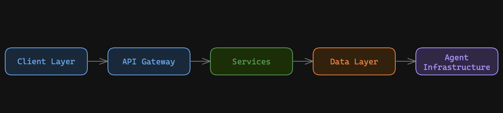
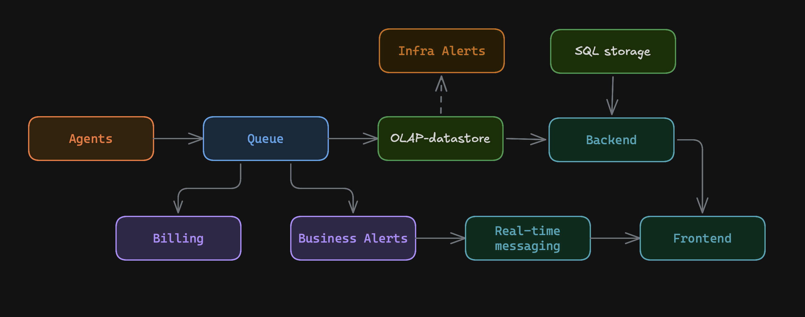
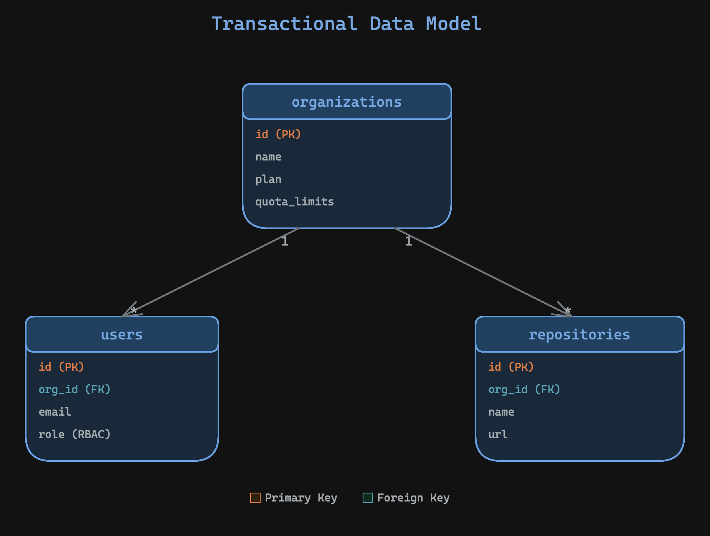
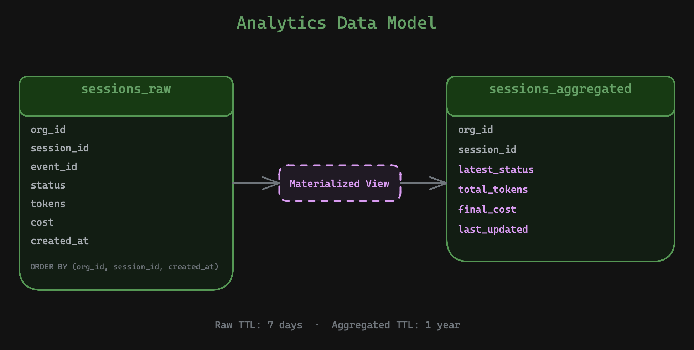
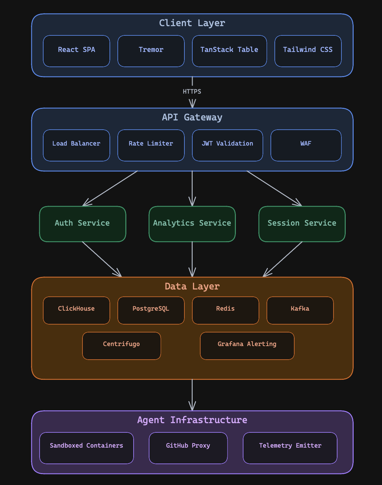
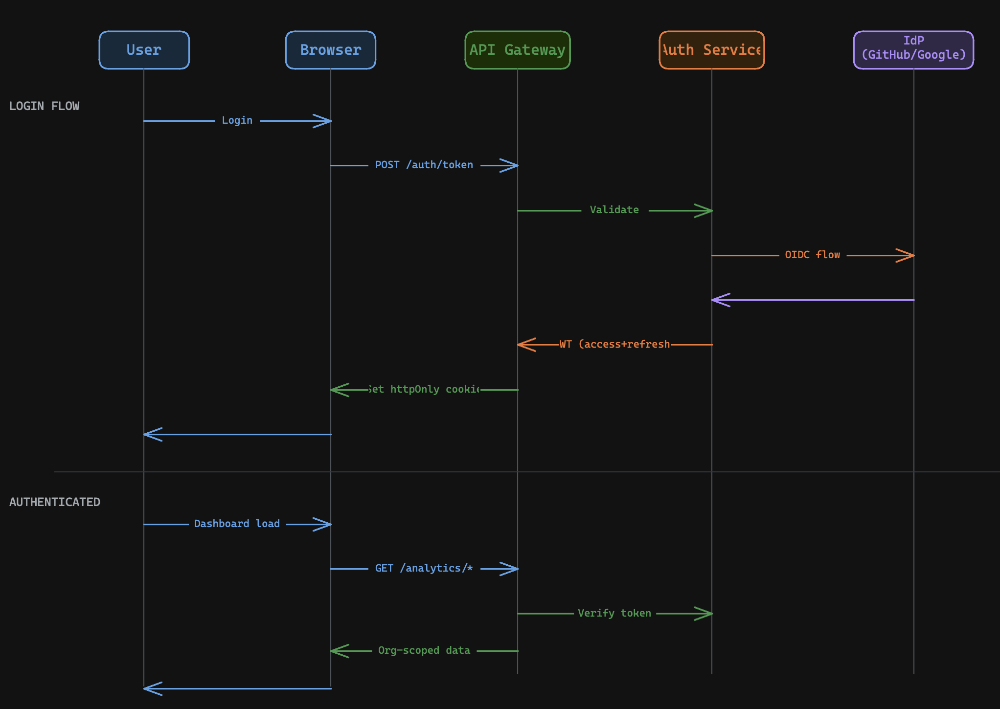
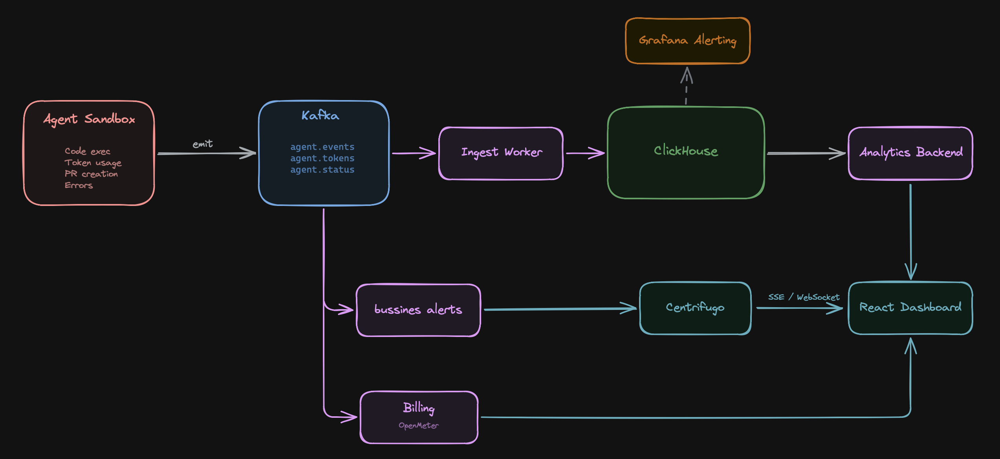

# AgentCloud: Organization Analytics Dashboard — System Design Interview

> **Task:** Design a customer-facing analytics dashboard for a platform where engineering teams run AI coding agents in the cloud. Agents perform tasks (bug fixes, refactoring, scaffolding) in isolated sandboxes and generate Pull Requests. The dashboard serves as the control plane for managers and platform teams: monitoring sessions, costs, team productivity, and system health.

---

## Step 1: Understanding the Problem and Gathering Requirements

### 1.1 Clarifying Questions

| Question | Answer / Assumption |
|---|---|
| Who are the primary dashboard users? | Engineering managers, platform teams, individual developers |
| Is multi-tenancy required? | Yes — the dashboard serves multiple organizations with strictly isolated data |
| Should the dashboard display real-time data? | Partially: activity feed and session statuses are real-time (SSE/WebSocket), analytics are near real-time (latency < 60 seconds) |
| Is a role-based access model needed? | Yes — `org_admin`, `member`, `viewer` with different data access granularity |
| What are the key metrics? | Sessions, tokens, costs (USD), PRs, errors, quotas, team activity |
| Integration with external IdPs? | Yes — GitHub and Google OAuth2/OIDC |

### 1.2 Functional Requirements

- **Overview dashboard**: KPI cards (sessions, costs, PRs), trend charts (tokens, outcomes), top repositories
- **Usage & Costs**: spending trend, breakdown by category (input/output tokens, compute, storage), cost per session, quotas with progress bars, budget alerts (75/90/100%)
- **Agent Sessions**: session table with filters (status, repository, user) and cursor pagination, detailed session page with timeline
- **Team Activity**: per-member activity, leaderboard, live activity feed (SSE), adoption rate
- **Authentication**: OAuth2/OIDC (GitHub, Google), short-lived JWT access tokens (2–5 min) + long-lived refresh tokens, revocation on refresh
- **RBAC**: three roles with different data access levels

### 1.3 Non-Functional Requirements

| Requirement | Target Value |
|---|---|
| **Availability** | 99.9% (acceptable ~8.7 hours downtime/year) |
| **Latency** (API P95) | < 500 ms |
| **Data freshness** (event → dashboard) | < 60 seconds |
| **Auth token validation** | < 50 ms |
| **Session start success rate** | > 99.5% |

### 1.4 Load Estimation (Back-of-the-Envelope)

**Assumptions:**
- 500 organizations, ~50 developers per organization on average = **25,000 users**
- Each developer launches ~5 agent sessions per day
- Each session generates ~12 LLM calls, ~10 tool calls, 1 PR

**Calculations:**

| Metric | Value |
|---|---|
| Sessions per day | 25,000 × 5 = **125,000** |
| Events per day | 125,000 × ~25 events/session = **~3.1M** |
| RPS (events) | 3,100,000 / 86,400 ≈ **~36 RPS** (peak ×3 = ~108 RPS) |
| RPS (dashboard API) | ~500 concurrent users × 1 req/10s = **~50 RPS** |
| Storage (raw events, 1 year) | 3.1M × 365 × ~500 bytes ≈ **~565 GB** |
| Storage (aggregated, 1 year) | ~125K sessions/day × 365 × ~200 bytes ≈ **~9 GB** |

> The load is moderate — no extreme sharding required at launch, but the architecture should accommodate horizontal scaling.
>
> **Note on scale vs. complexity trade-off:** The current load (~36 RPS writes, ~50 RPS reads, ~500 GB/year) is well within the capability of a single PostgreSQL instance (or PostgreSQL + TimescaleDB for time-series). A monolithic service backed by PostgreSQL alone would handle this comfortably. The rest of this document describes the **target architecture (Phase 3)** — a distributed, horizontally scalable design with ×100 growth headroom. In practice, we reach it incrementally through a phased migration strategy (see §4.4), adding complexity only when concrete load signals justify it.

---

## Step 2: High-Level Design
### 2.1 Core Architecture



The system follows a **layered architecture** with strict separation of concerns across 5 tiers:

1. **Client Layer** — a single-page application responsible for rendering analytics, managing client-side cache, and maintaining authenticated sessions. The client never accesses data stores directly; all data flows through the API layer.

2. **API Gateway** — a stateless entry point that handles TLS termination, rate limiting (per organization and pricing tier), request authentication (token validation), and API versioning. It routes traffic to the appropriate backend service and acts as a security boundary (WAF, DDoS protection).

3. **Service Layer** — a set of independently deployable services, each owning a single domain:
   - *Auth Service* — identity federation with external providers, token issuance and rotation, role-based access control enforcement.
   - *Analytics Service* — KPI aggregation, time-series queries, quota tracking, cost computation.
   - *Session Service* — session lifecycle management, filtering, search, cursor-based pagination.

   Services are stateless and horizontally scalable. Each service communicates with the data layer through well-defined interfaces and never exposes storage details to the layers above.

4. **Data Layer** — composed of purpose-specific stores:
   - *OLAP store* — columnar storage optimized for analytical queries, aggregation, and time-series data with built-in compression and TTL-based retention.
   - *OLTP store* — relational database for transactional data (users, organizations, metadata) with row-level security for tenant isolation.
   - *Cache / Session store* — in-memory key-value store: cache for computed KPIs (TTL seconds–minutes) and session store for refresh token metadata (TTL matching token lifetime).
   - *Message broker* — durable event stream that decouples agent infrastructure from the analytics pipeline, supports replay, and fans out to multiple consumers.
   - *Real-time gateway* — a dedicated component that manages persistent client connections (WebSocket/SSE), handles reconnection and message recovery, and scales horizontally via the cache layer's pub/sub capability.

5. **Agent Infrastructure** — sandboxed execution environments where AI agents run. Each session is fully isolated. The infrastructure emits telemetry events into the message broker and has no direct dependency on the dashboard services.

#### Data Flow



The data flow follows a **push-based, event-driven pipeline** with three distinct paths:

**1. Ingestion path (agent → analytics store):**
Agent sandboxes emit structured telemetry events (session status changes, token consumption, cost accrual, errors) into the message broker. The Ingestion Worker validates and batches events into the OLAP store's append-only raw storage. Materialized views incrementally maintain pre-aggregated analytical state (latest status, total tokens, cost trends) without requiring batch recomputation. A separate Billing Service consumes the same Kafka topic and writes financial transactions to PostgreSQL with ACID guarantees (see §3.3).

**2. Query path (client → API → store → client):**
The client issues authenticated API requests through the gateway. The gateway validates the token and routes the request to the appropriate service. The service reads from the cache (hit) or queries the OLAP/OLTP store (miss), populates the cache, and returns the response. All queries are scoped by organization ID extracted from the verified token — there is no way to query across tenant boundaries.

**3. Real-time path (event → client push):**
Specialized consumers on the message broker evaluate business rules (budget threshold breaches, error spikes) and session state transitions. When a notable event occurs, the consumer publishes a message to the real-time gateway, which pushes it to all subscribed clients for that organization's channel. The client receives updates without polling, keeping the activity feed, alerts, and session statuses live.

### 2.2 API Design

All endpoints require `Authorization: Bearer <jwt>`, data is scoped by `org_id` from the token.

```
Authentication:
  GET    /api/v1/auth/login/{provider} Redirect to GitHub/Google OAuth2
  GET    /api/v1/auth/callback/{provider} Authorization Code + PKCE → JWT
  POST   /api/v1/auth/refresh         Refresh token rotation
  GET    /api/v1/auth/me              Current user profile + org

Analytics:
  GET    /api/v1/analytics/overview   Organization KPI summary
  GET    /api/v1/analytics/timeseries/{metric}
         ?range=7d|30d|90d&granularity=hour|day
  GET    /api/v1/analytics/quotas     Quota progress vs plan limits
  GET    /api/v1/analytics/costs      Cost breakdown
  GET    /api/v1/analytics/errors     Error distribution

Sessions:
  GET    /api/v1/sessions             Cursor pagination + filters
         ?status=completed|failed&repo=&user=&cursor=&limit=50
  GET    /api/v1/sessions/{id}        Session details with timeline

Team:
  GET    /api/v1/analytics/team       Per-member statistics
  GET    /api/v1/analytics/team/feed  SSE — live activity feed

Repositories:
  GET    /api/v1/analytics/repositories  Per-repository statistics
```

### 2.3 Data Model

**Transactional** data:



**Analytics and time-series**:



### 2.4 API Response Format (Pagination)

Cursor-based pagination — stable under concurrent writes, no `COUNT(*)`:

```json
{
  "data": [...],
  "pagination": {
    "next_cursor": "sess_2024031015301234",
    "prev_cursor": "sess_2024031015290042",
    "has_more": true,
    "limit": 50
  }
}
```

**Why no `total` field:**

The whole point of cursor pagination is to avoid scanning the full result set. Returning an exact `total` with arbitrary filters (`status`, `user`, `repo`) forces ClickHouse to scan data — negating the performance benefit of cursors. Instead:

- **`has_more`** is the only signal the client needs — computed cheaply by fetching `limit + 1` rows and checking if the extra row exists.
- **UI pattern:** infinite scroll / "Load more" button (no page numbers needed).
- **When a count is truly needed** (e.g., "Showing N active sessions" badge on the Overview page), it comes from a **pre-aggregated materialized view** — not from `COUNT(*)` over the raw table. This count is eventually consistent and is returned by a separate `/analytics/overview` endpoint, not by the paginated list endpoint.

---

## Step 3: Deep Dive

### 3.1 Technology Choices and Rationale

| Component | Choice | Why | Alternatives |
|---|---|---|---|
| **OLAP storage** | ClickHouse | Columnar storage, 10-20x compression, sub-second analytical queries, built-in TTL policies, Row Policies for tenant isolation | TimescaleDB (row-oriented for time-series, simpler but slower on aggregations), Druid (more complex ops) |
| **OLTP storage** | PostgreSQL | Transactions, RLS (Row-Level Security), mature ecosystem, ideal for users/orgs/metadata | MySQL (less powerful types), CockroachDB (overhead for this scale) |
| **Message queue** | Kafka | Durability, replay, multiple independent consumers (analytics, billing, alerts) | RabbitMQ (no replay), Pulsar (less mature ecosystem) |
| **Cache** | Redis | TTL-based cache, Pub/Sub for Centrifugo scaling, refresh token metadata | Memcached (no persistence, no Pub/Sub) |
| **Real-time gateway** | Centrifugo | Connection management, reconnection, message recovery, horizontal scaling — all out of the box. Backend simply POSTs events | Custom SSE (sse-starlette) — for simple cases, doesn't scale |
| **Auth** | fastapi-users + fastapi-sso | Saves ~500 lines of boilerplate: JWT, refresh rotation, password reset, OAuth2 | SuperTokens, Keycloak — full-fledged IdPs, but more operational overhead |
| **Frontend charts** | Tremor | 35+ analytics components (KPI cards, charts, dark mode), built on Recharts + Radix UI | Recharts directly (more custom code), Highcharts (license) |
| **Data table** | TanStack Table | Headless, server-side sorting/filtering, cursor pagination, 100k+ rows | AG Grid (heavier, commercial license) |



### 3.2 Authentication and Authorization

**Flow — Authorization Code + PKCE (OAuth 2.1):**



The SPA uses **Authorization Code Flow with PKCE** — the only OAuth 2.1–compliant flow for public clients (browser apps). The deprecated Resource Owner Password Credentials (ROPC) flow is not used: it exposes user credentials to the client and is unsupported by GitHub/Google OAuth.

```text
1. SPA generates code_verifier + code_challenge (SHA-256)
2. SPA redirects to /api/v1/auth/login/{provider}
   → Auth Service redirects to provider (GitHub/Google) with code_challenge
3. User authenticates at the provider
4. Provider redirects back to /api/v1/auth/callback/{provider}?code=...
5. Auth Service exchanges authorization code + code_verifier for provider tokens
6. Auth Service issues internal JWT (access) + refresh token (httpOnly cookie)
7. SPA receives JWT, stores in memory (never localStorage)
```

**Token structure:**

```json
{
  "jti": "tok_a1b2c3d4e5f6",
  "sub": "user@acme-corp.io",
  "org_id": "org_abc123",
  "role": "org_admin",
  "plan": "enterprise",
  "iat": 1710000000,
  "exp": 1710000180
}
```

**Token Lifecycle — Short-lived Access + Long-lived Refresh:**

The classic JWT denylist approach (Redis lookup on every request) adds a synchronous network call to a stateful store on every API call, negating the core benefit of JWT (stateless validation) and creating a single point of failure (Redis down → entire API down).

Instead, we use a **short-lived access token** pattern:

| Token | TTL | Validation | Storage |
|---|---|---|---|
| Access Token (JWT) | **2–5 min** | Cryptographic signature only — **no network calls**, fully stateless | Client memory |
| Refresh Token | 7–30 days | Auth Service checks Redis/PostgreSQL for revocation status | httpOnly cookie |

**How revocation works without a denylist:**

1. Admin revokes a user → Auth Service marks the refresh token as revoked in PostgreSQL.
2. The current access token remains valid for at most 2–5 minutes (acceptable window for a read-only dashboard).
3. On the next refresh attempt, Auth Service rejects the revoked refresh token → user is logged out.
4. No Redis call is needed on the hot path (regular API requests) — the API Gateway only verifies the JWT signature.

```python
# API Gateway middleware — pure cryptographic check, no I/O
def verify_access_token(token: str) -> dict:
    return jwt.decode(token, public_key, algorithms=["RS256"])  # stateless

# Auth Service — called only on refresh (once per 2-5 min per user)
async def refresh_tokens(refresh_token: str) -> TokenPair:
    record = await db.get_refresh_token(refresh_token)
    if not record or record.revoked:
        raise HTTPException(status_code=401, detail="Token revoked")
    # Issue new short-lived access token + rotated refresh token
    return issue_token_pair(record.user_id, record.org_id)
```

**Trade-off:** revocation is not instant (up to 5 min delay) vs. the denylist approach (instant but stateful). The 2–5 min window is acceptable for a read-only analytics dashboard — a revoked user can view stale charts for a few minutes but cannot perform any destructive actions.

> **Why not Centrifugo force-disconnect?** Centrifugo can close WebSocket/SSE connections immediately, but this does not invalidate the JWT — the client can still make regular API requests until the token expires. Force-disconnect is useful for cutting the real-time feed, but the short TTL is the actual revocation mechanism for API access.
>
> **Redis load impact:** with 500 concurrent users and a 3-min TTL, refresh traffic is ~500/180 ≈ **~2.8 calls/sec** — negligible compared to ~50 calls/sec with per-request denylist lookups (**~18x reduction**). Even at 5,000 users (10x growth), refresh stays under ~28 calls/sec.

**RBAC:**

| Role | Dashboard | Session Details | Cost Data | Team Activity | Admin |
|---|---|---|---|---|---|
| `org_admin` | Full | Full | Full | Full | Full |
| `member` | Full | Own + team | Aggregated | View only | None |
| `viewer` | Read-only | Summary | None | None | None |

### 3.3 Data Ingestion Pipeline



**Kafka partition key — `session_id`:**

Events are partitioned by `session_id` (UUID), not by `org_id`. Rationale:

- **No hot partitions** — UUID hashes distribute uniformly regardless of organization size. With `org_id` partitioning, a 10,000-developer org would funnel all traffic into a single partition while small orgs sit idle.
- **Per-session ordering preserved** — all lifecycle events for a session (`created → running → completed`) land in the same partition, maintaining causal order where it matters.
- **Org-level ordering is not required** — the Ingestion Worker batches by time window (not by org), the Billing Service is idempotent via `event_id`, and the alert evaluator aggregates by timestamp.

Key architectural decision — a lightweight **Ingestion Worker** between Kafka and ClickHouse instead of ClickHouse Kafka Engine:

**Why Ingestion Worker over Kafka Engine:**

ClickHouse Kafka Engine eliminates an infrastructure tier by letting ClickHouse consume Kafka directly. However, it introduces critical production risks:

- **Poison pill vulnerability** — a single malformed message (invalid JSON, schema mismatch) can stall the entire pipeline or cause silent data loss depending on `kafka_skip_broken_messages` settings.
- **No Dead Letter Queue (DLQ)** — there is no built-in mechanism to route unparseable messages for inspection; they are either skipped or block consumption.
- **Limited batching control** — flush intervals and batch sizes are constrained by Kafka Engine internals, making it hard to tune for optimal ClickHouse insert performance.

**Ingestion Worker responsibilities:**

A stateless Python service (alternatively [Vector](https://vector.dev/) or [Benthos](https://www.benthos.dev/) for a config-driven approach):

1. **Schema validation** — validates each message against the expected schema before forwarding; rejects malformed events early.
2. **Dead Letter Queue** — routes invalid messages to a dedicated `events.dlq` Kafka topic with the original payload + error metadata for later investigation.
3. **Batch assembly** — accumulates validated events into optimally-sized batches (tuned for ClickHouse MergeTree part sizes) and inserts via `INSERT ... FORMAT Native` for maximum throughput.
4. **Back-pressure handling** — if ClickHouse is temporarily unavailable, the worker pauses consumption (Kafka retains messages), preventing data loss without complex retry logic.

> The worker adds one lightweight, stateless component but eliminates a class of hard-to-debug production incidents. It is horizontally scalable and can be deployed as a simple Kubernetes Deployment with no persistent state.

**Deduplication via `argMax` (analytics only):**

- `AggregatingMergeTree` with `argMaxState` resolves duplicates by keeping the latest value per `(org_id, session_id)` key based on `created_at`
- All analytical queries must use `-Merge` combinators (`argMaxMerge`, `sumMerge`, etc.) to correctly fold unmerged parts at query time — without them, pre-merge results may contain transient duplicates
- The `FINAL` modifier is not required: `-Merge` combinators achieve the same correctness with better performance (they operate only on the aggregate states, not on raw rows)
- This approach has **eventual consistency** semantics (merge timing is non-deterministic) — acceptable for dashboards and analytics, but **not for billing**

**Billing — separate ACID path (PostgreSQL):**

Financial transactions must never rely on an OLAP store with eventual consistency. A dedicated **Billing Service** consumes cost-accrual events from the same Kafka topic independently:

```text
Kafka (events topic)
  ├── Ingestion Worker ──▶ ClickHouse  (analytics: tokens, trends, dashboards)
  └── Billing Service   ──▶ PostgreSQL (money: charges, invoices, ledger)
```

Billing Service guarantees:

1. **ACID transactions** — each charge is written to PostgreSQL within a transaction, ensuring atomicity and durability.
2. **Idempotency via `event_id`** — every cost event carries a unique `event_id`; the `billing_events` table has a `UNIQUE(event_id)` constraint. Kafka retries or duplicate deliveries result in a conflict → no double charges.
3. **Isolation from analytics** — ClickHouse downtime, slow merges, or schema migrations have zero impact on billing correctness.

```sql
CREATE TABLE billing_events (
    id            BIGSERIAL PRIMARY KEY,
    event_id      UUID NOT NULL UNIQUE,  -- idempotency key from Kafka
    org_id        TEXT NOT NULL,
    session_id    TEXT NOT NULL,
    amount_usd    NUMERIC(12, 6) NOT NULL,
    category      TEXT NOT NULL,          -- input_tokens, output_tokens, compute
    created_at    TIMESTAMPTZ NOT NULL DEFAULT now()
);
```

> The Analytics Service reads cost data for dashboards from ClickHouse (eventual consistency is fine for charts). The Billing Service is the **single source of truth** for actual charges and feeds invoicing, quota enforcement, and budget alerts.
>
> **Reconciliation:** two independent consumers of the same Kafka topic will inevitably diverge (consumer lag, ClickHouse merge timing, DLQ-routed events). A periodic reconciliation process — comparing aggregated totals between ClickHouse and PostgreSQL and flagging discrepancies — is essential but left out of scope here, as billing in general warrants its own design document covering invoicing, proration, dispute handling, and audit trail.

### 3.4 Multi-Tenancy

Tenant isolation is enforced at **two independent levels** (defense in depth):

**Level 1 — Application layer** (primary path):

1. Every endpoint extracts `org_id` from the verified JWT via `Depends(get_current_org)`
2. `org_id` is passed as a parameter using `{org_id:String}` syntax (parameterized queries)
3. String concatenation for `org_id` is strictly prohibited

```python
async def get_current_org(token: str = Depends(oauth2_scheme)) -> str:
    payload = verify_jwt(token)
    return payload["org_id"]  # always from verified token
```

**Level 2 — ClickHouse Row Policies** (fail-safe):

ClickHouse supports Row-Level Security via `CREATE ROW POLICY` (available since v20.3). A single shared ClickHouse user per service (e.g., `analytics_service`) is used — **not** a user per organization. Tenant scoping is enforced via a **custom session-level setting** that the application sets on every connection:

```sql
-- 1. Declare a custom setting (once, at cluster level)
SET CUSTOM_SETTINGS = 'tenant_org_id String';

-- 2. Create a row policy that reads org_id from the session setting
CREATE ROW POLICY tenant_isolation ON sessions
    USING org_id = getSetting('tenant_org_id')
    TO analytics_service;

-- Repeat for each table: sessions_raw, sessions_aggregated, etc.
```

The application layer sets `tenant_org_id` on every query via connection settings — the value comes from the verified JWT, never from user input:

```python
async def query_clickhouse(org_id: str, query: str, params: dict):
    """All ClickHouse queries go through this function."""
    return await clickhouse_client.query(
        query,
        params=params,
        settings={"tenant_org_id": org_id},  # session-level, per-query
    )
```

If the application has a bug and omits the `WHERE org_id = ?` clause, the row policy still filters by `tenant_org_id` — the database silently returns zero rows instead of leaking cross-tenant data. If `tenant_org_id` is not set (empty string), the policy matches nothing.

**PostgreSQL** — RLS (Row-Level Security) for its own tables (users, orgs, metadata), following the same defense-in-depth principle.

### 3.5 ClickHouse: Schema and Queries

**Key design decisions:**

- **Ingestion Worker** — a stateless service ( Vector / Benthos) between Kafka and ClickHouse that validates schemas, routes malformed events to a DLQ topic, and assembles optimally-sized batches (see §3.3)
- **Two-stage pipeline**: raw `MergeTree` storage → `AggregatingMergeTree` via Materialized Views for incremental pre-aggregation
- **Deduplication (analytics)** — `argMaxState` keeps the latest value per `(org_id, session_id)` key; all queries use `-Merge` combinators to correctly fold unmerged parts at query time (see §3.3). Financial data lives in PostgreSQL
- **Primary key** — `ORDER BY (org_id, ...)` ensures optimal data skipping for all tenant-scoped queries
- **Retention (TTL)** — raw events 90 days (~140 GB at current load, well within single-node capacity), aggregated data 1 year

> Full schema definitions, queries, and migration details: [CLICKHOUSE.md](CLICKHOUSE.md)

### 3.6 Real-Time Layer (Centrifugo)


**Channels:**
- `org:{org_id}:feed` — activity feed (sessions, PR merges)
- `org:{org_id}:alerts` — budget warnings, error spikes
- `org:{org_id}:sessions` — live session statuses

**Fallback:** for simple SSE endpoints (single session log streaming) — `sse-starlette` directly in FastAPI.

### 3.7 API Gateway

The API Gateway is the single entry point for all client traffic. Key responsibilities:

- **TLS termination** and HTTPS enforcement
- **Rate limiting** — per organization and pricing tier, preventing noisy-neighbor effects
- **JWT validation** — verifies access token signature (stateless, no network calls) before forwarding to backend services
- **WAF** — OWASP rule set for request filtering (SQL injection, XSS, etc.)
- **API versioning** — routes `/api/v1/` prefix to the appropriate service version
- **Load balancing** — distributes requests across stateless service instances with health checks

> Full configuration, rate limit tiers, and routing rules: [API_GATEWAY.md](API_GATEWAY.md)

### 3.8 Alerting Strategy

Two-tier approach to avoid building a custom notification system:

**Business alerts** — custom `alert-evaluator` Kafka consumer:
- Budget thresholds: 75%, 90%, 100% of spending limit
- Quota exhaustion: sessions, tokens, concurrent slots
- Published to Centrifugo → real-time notifications in UI

**Infrastructure/SRE alerts** — Grafana Alerting + ClickHouse data source:
- API latency P95 > 500ms
- Pipeline lag > 60s
- Error rate spikes (sandbox crashes, rate limits)
- Routing: Slack, PagerDuty, email via Grafana contact points

```sql
-- Example: P95 latency alert in Grafana
SELECT quantile(0.95)(latency_ms) AS p95_latency
FROM api_requests
WHERE org_id = {org_id:String}
  AND created_at >= now() - INTERVAL 5 MINUTE;

-- Example: Error rate alert
SELECT countIf(status = 'error') / count() AS error_rate
FROM sessions_raw
WHERE org_id = {org_id:String}
  AND created_at >= now() - INTERVAL 5 MINUTE;
```

### 3.9 Observability

OpenTelemetry distributed tracing — trace per session:

```
Trace: session_abc123
├─ Span: auth.validate_token          (2ms)
├─ Span: session.create               (15ms)
├─ Span: sandbox.provision            (1200ms)  ← main latency
│  ├─ Span: container.pull_image      (800ms)
│  └─ Span: container.start           (400ms)
├─ Span: agent.execute                (45000ms)
│  ├─ Span: llm.completion (x12)      (token counts as attributes)
│  ├─ Span: tool.file_write (x8)
│  └─ Span: tool.git_commit (x2)
├─ Span: pr.create                    (3000ms)
└─ Span: session.cleanup              (500ms)
```

---

## Step 4: Identifying Bottlenecks and Scaling

### 4.1 Single Points of Failure (SPOF) and Mitigation

| Component | Risk | Mitigation |
|---|---|---|
| **API Gateway** | Single point of entry | Multi-AZ deployment, health checks, auto-scaling group |
| **ClickHouse** | Single OLAP node | ClickHouse Keeper + ReplicatedMergeTree, read replicas for dashboard queries |
| **Kafka** | Event loss | Replication factor ≥ 3, `acks=all` from producers, ISR (In-Sync Replicas) |
| **Redis** | Cache / Pub/Sub loss | Redis Sentinel or Cluster mode; on total loss — cache rebuilds from source, refresh tokens fall back to PostgreSQL |
| **Centrifugo** | Real-time feed disruption | Redis-backed Pub/Sub for horizontal scaling, auto-reconnection on client, message recovery |
| **PostgreSQL** | Transactional data loss | Streaming replication, automated failover (Patroni), point-in-time recovery |

### 4.2 Performance Optimization

**Caching (Redis):**
- Overview KPI cards: TTL 60 seconds (event-based invalidation)
- Quotas: TTL 30 seconds (freshness-sensitive)
- Repository list: TTL 5 minutes (rarely changes)
- Refresh token metadata: TTL = refresh token lifetime (7–30 days)

**ClickHouse optimizations:**
- `ORDER BY (org_id, ...)` — all queries start with org_id, ensuring optimal data skipping
- `AggregatingMergeTree` instead of `GROUP BY` at query time — pre-computed aggregates
- Columnar compression: 10-20x on typical analytical data

**CDN and static assets:**
- React SPA bundle, fonts (Inter, JetBrains Mono) — via CDN
- API responses with KPIs are not cached on CDN (org-scoped)

**Client-side optimization:**
- TanStack Query: `staleTime: 60s`, `retry: 1` — minimizes redundant requests
- Cursor-based pagination: stable under concurrent inserts (unlike offset)

### 4.3 Scaling at 10x Growth

At 5,000 organizations / 250,000 users:

| Layer | Current | At 10x | Actions |
|---|---|---|---|
| **API** | 2-3 instances | 10-15 instances | Horizontal scaling behind Load Balancer, stateless services |
| **ClickHouse** | Single node | Cluster (3+ shards) | Sharding by `org_id` (consistent hashing), ReplicatedMergeTree |
| **Kafka** | 3 brokers | 6-9 brokers | Increase partitions per topic, partitioned by `session_id` (uniform distribution, no hot partitions) |
| **PostgreSQL** | Single primary + replica | Primary + 2 replicas | Read replicas for auth-heavy queries; sharding by org_id if needed |
| **Redis** | Standalone | Cluster (3 masters) | Sharding cache and Pub/Sub |
| **Centrifugo** | 1-2 nodes | 3-5 nodes | Redis-backed scaling already built into the architecture |

### 4.4 Phased Migration Strategy

The target architecture (Steps 2–3) is the end state, not the starting point. Each phase is triggered by concrete, measurable signals — not by projections.

#### Phase 1 — Monolith + PostgreSQL + TimescaleDB

A single FastAPI application backed by PostgreSQL (transactional data + RLS) and TimescaleDB hypertable (time-series events, continuous aggregates for KPIs). Real-time feed via `sse-starlette` directly in the monolith. Redis for caching only.

This phase handles the initial load comfortably: ~36 RPS writes, ~50 RPS reads, ~500 GB/year.

| Trigger to move to Phase 2 | Signal |
|---|---|
| Analytical queries degrade API latency | P95 of `/analytics/*` endpoints > 300 ms despite continuous aggregates |
| TimescaleDB compression ratio insufficient | Storage growth exceeds retention policy capacity |
| Event ingestion contends with OLTP writes | Write latency on transactional tables increases under event load |
| Need for independent event consumers | Billing, alerting, or other services need the same event stream |

#### Phase 2 — Extract Analytics Pipeline (Kafka + ClickHouse)

Introduce Kafka as the event backbone and ClickHouse as the dedicated OLAP store. The Ingestion Worker (§3.3) lands events into ClickHouse with schema validation and DLQ. PostgreSQL retains transactional data (users, orgs, billing). The monolith splits into 2–3 services (Auth, Analytics, Sessions) but can still share a deployment if traffic is manageable.

| Trigger to move to Phase 3 | Signal |
|---|---|
| SSE connections exceed single-process limits | > 5K concurrent SSE connections or event fan-out latency > 1s |
| Service coupling slows deployments | Auth or analytics changes require full redeployment and coordinated testing |
| Multi-region or compliance requirements | Data residency constraints require geo-distributed components |

#### Phase 3 — Full Distributed Architecture (current design)

The architecture described in Steps 2–3: independently deployable services, Centrifugo for real-time (replacing sse-starlette), Redis Cluster for cache + Pub/Sub, ClickHouse cluster with sharding by `org_id`, and API Gateway as the single entry point.

> **Key principle:** each phase transition adds exactly one layer of complexity to address a specific, observed bottleneck. Rolling back a phase (e.g., dropping Centrifugo back to SSE if connection count decreases) should remain feasible.

---

## Step 5: Summary

### 5.1 Requirements Coverage

| Requirement | How It's Covered |
|---|---|
| Multi-tenant dashboard | `org_id` in JWT → parameterized queries (ClickHouse), RLS (Row-Level Security) (PostgreSQL) |
| Real-time updates | Centrifugo (SSE/WebSocket) with JWT auth and Redis scaling |
| Sub-500ms API latency | ClickHouse pre-aggregated views + Redis cache |
| < 60s data freshness | Kafka → Ingestion Worker → ClickHouse (validated, batched inserts) |
| RBAC (3 roles) | JWT claims + middleware enforcement |
| Secure auth | OAuth2/OIDC, RS256, httpOnly cookies, short-lived access tokens (revocation on refresh) |
| Budget alerts | Two-track: custom consumer (business) + Grafana Alerting (infra) |
| Cursor pagination | Stable under concurrent writes, no `COUNT(*)` — `has_more` flag via `LIMIT+1`; counts from pre-aggregated views |

### 5.2 Key Trade-offs

| Decision | Pros | Cons |
|---|---|---|
| **ClickHouse over TimescaleDB** | 10-20x compression, sub-second aggregations, Row Policies for tenant isolation | Eventual consistency during merges — billing must use PostgreSQL (see §3.3) |
| **Centrifugo over custom SSE** | Production-ready scaling, reconnection, recovery | Additional service in the infrastructure |
| **Ingestion Worker over Kafka Engine** | Schema validation, DLQ for poison pills, tunable batching | One additional stateless service to deploy |
| **Short-lived JWT over Redis denylist** | Fully stateless API Gateway, no Redis on hot path, no SPOF | Revocation delay up to 5 min (acceptable for read-only dashboard; see §3.2) |
| **Kafka partition by `session_id` over `org_id`** | Uniform distribution (no hot partitions), per-session ordering preserved | No org-level locality — acceptable since consumers don't need org ordering (see §3.3) |
| **fastapi-users over Keycloak** | Simpler deployment, less ops overhead | Less mature MFA, audit trail, enterprise features |

### 5.3 Out of Scope

The following concerns are intentionally left out of this document. Each warrants its own design or is addressed at the infrastructure/platform level rather than within the application architecture.

#### Data Privacy and Compliance (GDPR)

- **Right to erasure (Art. 17)** — deleting all data for an organization across ClickHouse, PostgreSQL, Kafka, and Redis. ClickHouse does not support efficient row-level `DELETE`; viable strategies include `ALTER TABLE DELETE` (async, heavyweight), TTL-based expiration, or **crypto-shredding** (encrypting tenant data with a per-org key and destroying the key on erasure request).
- **Data retention policies** — beyond technical TTLs (§3.5), contractual retention limits per organization and jurisdiction.
- **Data Processing Agreements (DPA)** — required for EU customers; affects sub-processor list (cloud provider, Kafka managed service, etc.).
- **Right to portability (Art. 20)** — export API for organizations to download their data in a machine-readable format.

#### Operational Concerns

- **Secrets management** — storage and rotation of JWT signing keys, database credentials, Kafka certificates, and API keys. Expected solution: HashiCorp Vault or cloud-native KMS (AWS KMS / GCP Cloud KMS) with automatic rotation.
- **Encryption at rest** — ClickHouse and PostgreSQL do not encrypt data files by default. Enabled at the storage layer (LUKS, cloud-managed encrypted volumes) or via database-native encryption (PostgreSQL TDE, ClickHouse encrypted disks).
- **Connection pooling** — at 10-15 API instances (§4.3), direct connections to PostgreSQL exhaust `max_connections`. PgBouncer (transaction mode) between services and PostgreSQL; ClickHouse native connection pooling via the client library.
- **Structured logging** — OpenTelemetry tracing is covered (§3.9), but the logging strategy (format, levels, correlation with trace IDs, log aggregation — ELK / Loki) is not specified.
- **Circuit breakers and graceful degradation** — what happens when ClickHouse, Redis, or Centrifugo is temporarily unavailable. Expected patterns: circuit breaker (Tenacity / custom middleware), serving stale cache on downstream failure, health check propagation.

#### Deployment and Release

- **Deployment strategy** — blue/green, canary, or rolling deployments for zero-downtime releases. Rollback procedures for each service independently.
- **Database migrations** — schema migration tooling (Alembic for PostgreSQL, ClickHouse `ALTER` migrations) and backward-compatible migration strategy for zero-downtime deploys.
- **Feature flags** — gradual rollout of new dashboard features and A/B testing without redeployment.

#### API Completeness

- **Error response format** — a standardized error envelope (RFC 7807 Problem Details or a custom schema) with `error_code`, `message`, `details`, and `request_id` for all non-2xx responses.
- **Sorting on list endpoints** — the Sessions endpoint (`GET /sessions`) currently supports filtering and cursor pagination but not `sort_by` (e.g., by cost, duration, created_at). Required for table UI.
- **Rate limit headers** — `X-RateLimit-Limit`, `X-RateLimit-Remaining`, `X-RateLimit-Reset` in API responses so clients can implement backoff.

#### Cost Estimation

- Infrastructure cost modeling for the target architecture (Kafka cluster, ClickHouse cluster, Redis, Centrifugo, compute) is not included. A separate capacity planning exercise is needed before Phase 2 migration (§4.4) to validate that the distributed architecture is cost-justified at the projected scale.

### 5.4 Future Improvements Given More Time

- **Anomaly detection and ML**: automatic detection of abnormal spending or error patterns
- **Multi-region**: geo-distributed ClickHouse cluster for global teams
- **Audit log**: immutable log of all admin actions for compliance
- **Agent A/B testing**: comparing performance across different models/configurations
- **Self-service quotas**: UI for org_admins to configure limits and alerts without contacting support
- **Export and integrations**: API for data export to BI systems (Looker, Metabase), webhooks for external alerts
